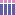

# <span style="color:#42bff4">Interfaces</span>

## <span style="color:#42bff4">SVG Interface Description</span>

### <span style="color:#42bff4">Some helpful tools</span>

Use **imagemagick** to convert from SVG to PNG:

```
convert input.svg output.png
```

Use the following command to format SVG:

```
cat input.svg | xmllint --format - > output.svg
```

### <span style="color:#42bff4">Interface Format</span>

- *.mi* &mdash; Muses interface format 

The interface language is a purely functiontional described as a subset of the functional language [Haskell](https://www.haskell.org/).

A special syntax is used for arguments, using fist class labels, which enables us to name aguments both in the type of the control functions, but also when pass values to them.

The following four controllers represent different types of pad controllers, when pressed send any static or dynamically provided arguments to the provided address. They are stateless.

```haskell
rectPad :: "x" :! Int -> "y" :! Int -> 
           "width" :! Int -> "height" :! Int -> 
           "address" :! Text -> Contoller
```

```haskell
ciPad :: "x" :! Int -> "y" :! Int -> "r" :! Int -> "address" :! Text -> Controller
```

```haskell
ciPadCor :: "x" :! Int -> "y" :! Int -> "r" :! Int -> "address" :! Text -> Controller
```

A special case of **rectPad** is a square pad:

```haskell
pad :: "x" :! Int -> "y" :! Int -> "size" :! Int -> "address" :! Text -> Controller
```

A vertical or horizontal **slider** encoder, which generates a value with a specified range. Moving up (horz) or to the right (vert) causes the sent value to inrease and moving to the left (horz) or down (vert) causes the value to decrese. 

```haskell
slider :: "x" :! Int -> "y" :! Int -> 
            "width" :! Int -> "height" :! Int -> 
                "min" :! Int -> "max" :! Int ->
                    "address" :! Text -> Element
```


An **endless** encoder, which generates the value **65** when rotating clockwise and **63** when rotating anti-clockwise, 
is expressed with the following controller:

```haskell
endless :: "cx" :! Int -- centre X 
            -> "cy" :! Int -- centre y
                -> "or" :! Int -- outer radius
                    -> "ir" :! Int -- inner radius
                        -> "address" :! Text -- OSC address
                            -> Element
```

The endless controller is stateless with respect to the messages it sends.


The following interface controllers generate fixed global OSC messages, for some particular use cases.

```haskell
stop :: "x" :! Int -> "y" :! Int -> "size" :! Int -> Controller
```

Outputs the message <span style="color:#f4c542">**/stop**</span>, when pressed. 

```haskell
record :: "x" :! Int -> "y" :! Int -> "r" :! Int -> Controller
```

Outputs the message  <span style="color:#f4c542">**/record**</span>, when pressed.

```haskell
play :: "v1" :! (Int,Int) -> "v2" :! (Int,Int) -> "v3" :! (Int,Int) -> Controller
```

Outputs the message <span style="color:#f4c542">**/play**</span>, when pressed.

The contoller **border** adds a blue stoke around the outside of the interface, when converted to SVG, to help with cutting and placing of interfaces on the Sensel Morph. It has not effect on the interface at runtime.

Controllers form a Monoid and can be composed together using ```<>``` or ```mconcat```, and as per Monoids in Haskell ```mempty``` represents the empty controller, i.e. one with no effect. Each interface combines controllers together to form a top-level inteface. An interface file can contain any number of top-level controllers and thus interfaces, however, at least one and only one can be defined and named **interface**. When compiling an interface description the controller **interface** is translated to the resulting SVG interface. If **interface** is not present or there is a syntax error, then compilation fails.  

## <span style="color:#42bff4">ROLI Lightpad Block</span>

ROLI's [Lightpad Block](https://roli.com/products/blocks/lightpad-m) provides a touch responsive soft silicon playing surface, with reconfigurable RGB LEDs illuminating different actions performed by the user.

Due to the its small size, only 15x15, the set of valid SVG interfaces for the Lightpad is only a small subset, supporting pads, toggles, and horz and vertical sliders. In particular, endless sliders and path controls are not currently supported.

The following example demostrates creating an interface for the Lightpad that has four pads, along the top, and 4 sliders underneath:

```haskell
lightpad = 
  mconcat (map p [(0,100), (4, 101), (8, 102), (12, 103)])
  <>
  mconcat (map s [(0,104), (4, 105), (8, 106), (12, 107)])
  where
    p = \(x, cc) -> pad ! #x x ! #y 0 ! #size 3 ! #address "/midicc" # iargs [cc]
                                                                     # fill "rgb(217,137,188)"
    s = \(x, cc) -> 
      vertSlider ! #x x ! #y 4
                 ! #width 3 ! #height 11 ! #min 0 ! #max 127 ! #address "/midicc" # fill "rgb(96,95,164)"
                                                                                  # iargs [cc]
```

The resulting interface SVG is:



This exmaple highlights the use of colour, enabled by the Lightpads RGB LEDS, currently not supported with the Sensel, for example.

## <span style="color:#42bff4">Sensel Morph</span>

The Sensel Morph is velocity sensitive touch sensor developed by the company [Sensel](https://sensel.com/pages/the-sensel-morph). Swappable tactile interfaces can be placed on the sensor plate producing custom interfaces that provide expressive control of an digital musicial instrument.

An interface for the Sensel is originally described as an SVG Interface, as defined above. An SVG interface is compiled for the Sensel in a selection of different ways, which are categorized as follows:

- **interface printing**
- **interface driver**

The first of these, **interface printing**, is a set of processes that take the original SVG and use it to generate a physical overlay for the Sensel itself, which is representative of how the user will interact with interface and indireclty the Sensel. The simpliest of these is to simply print the SVG on a printer and cut out the resulting image and lay direclty on the Sensel. Other supported approaches uses Swell paper (often used for Brail), OpenSCAD generation for 3D printing interfaces and also for silicone mold creation. These methods range from virtually no input requirement from the user, e.g. printing the SVG on a lazer printer, to more explict work and involement from the designer, e.g. silicone mold casting.  

The second compilation method is to generate a representation of the SVG interface description that can be consumed by the **sensel-osc** application, which links the Sensel Morph, with a physical representation of the interface installed, with OSC messages generated by the user interacting with the interface. The details of this process are detailed in the Secton [Sensel Driver](#sensel-driver).

### <span style="color:#42bff4">Sensel Driver</span>

An interface SVG can be compiled with the **sensel_svg** application, which given an SVG interface builds a interface description represented in JSON. The generated JSON is loaded by the **sensel-osc** application and used to connect the physical representation of the interface, installed on a Sensel Morph, with the generation of OSC messages caused by user interaction.

Interfaces are loaded into the Sensel driver using a textural JSON---in the future this might change to use BJSON to enable faster and robust interchange. The syntax describing an interface captured in the following JSON schema, based on the draft standard defined here http://json-schema.org/draft-07/schema# (although we bend the rules ever so slightly):

```javascript
{
    "$id": "sensel_interface",
    "$schema": "http://json-schema.org/draft-07/schema#",
    "description": "Scheme for Sensel Interface",
    "type": "object",
    "properties": {
        "controllers": {
            "type": "array",
            "items": {
                "type": "$ref": "#/definitions/controller"
            },
            "description": "XXX"
        },
        "buffer": {
            "type": "array",
            "items": {
                "type": "integer"
            },
            "description": "XXX"
        }
    },
    "required": [ "controllers", "buffer" ],
    "definitions": {
        "controller": {
            "type": "object",
            "properties": {
                "id": {
                    "type": "integer",
                    "description": "XXX"
                },
                "type_id": {
                    "type": "string",
                    "description": "XXX"
                },
                "address": {
                    "type": "string",
                    "description": "XXX"
                }, 
                "args": {
                    "type": "array",
                    "description": "XXX"
                },
            },
            "required": [ "id", "type_id", "address", "args" ]
        }
    }
}
```

The value of the "type_id" field can be one of the following:

- **pad**     -- represents a button
- **slider**  -- represents a slider, with min, max, and increment
- **endless** -- represents an endless pot
- **note**    -- represents note on/off messages, with midi note and channel

For the "type_id" **slider** the following fields are required:

```javascript
    "min": {
            "type": "integer",
            "description": "minimum number of slider"
    }, 
    "max": {
            "type": "integer",
            "description": "maximum number of slider"
    },
    "inc": {
            "type": "integer",
            "description": "increment"
    }
```

A slider sends values between min and max, moving in **inc** increments, either positive or negative. Note it only sends postive numbers, the increments up and down the range are handled internally.

The value of the slider is encoded into the OSC message as the last argument, i.e. it is appended after any static arguments passed in the **args** array in the controller specification.

For the "type_id" **noteon** the following fields are required:

```javascript
    "note": {
            "type": "integer",
            "description": "MIDI note (e.g. C3)"
    }, 
    "channel": {
            "type": "integer",
            "description": "MIDI channel (0 through 15)"
    }
```

### <span style="color:#42bff4">Examples</span>

Example 1

```javascript
{ "controllers": [
    { 
        "type_id": "pad",
        "id": 1 
        "address": "/seq/chan", "args": [ { "type" : "i", "arg": 1 } ]
    }
  ],
  "buffer": [ [0,0,0,1,1,1,...], ..., [...1,1,0,0,0] ]
}
```